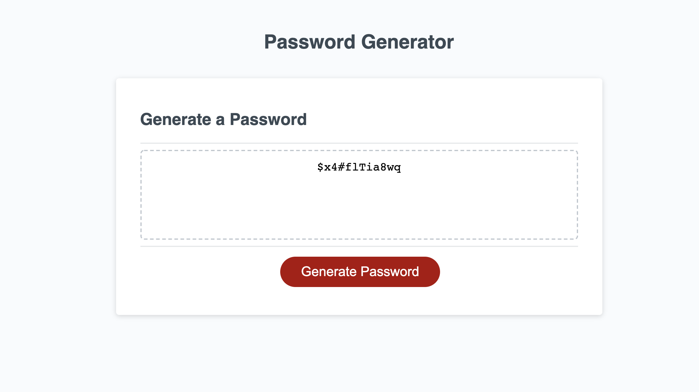

# Homework 3 - Random Password Generator

## Description

The following program generates a secure random password that includes special characters, numbers, capital letters, and lower case letters to provide greater security to sensitive data. This program also uses JavaScript in addition to using arrays, strings, fumctions and methods like .split() and .concat(). 

# Preview

The following image shows the web application's appearance and functionality:

## Link to Deployment

- [Deployed Link](https://hyanez.github.io/HW3-PASSWORD-GENERATOR/)
